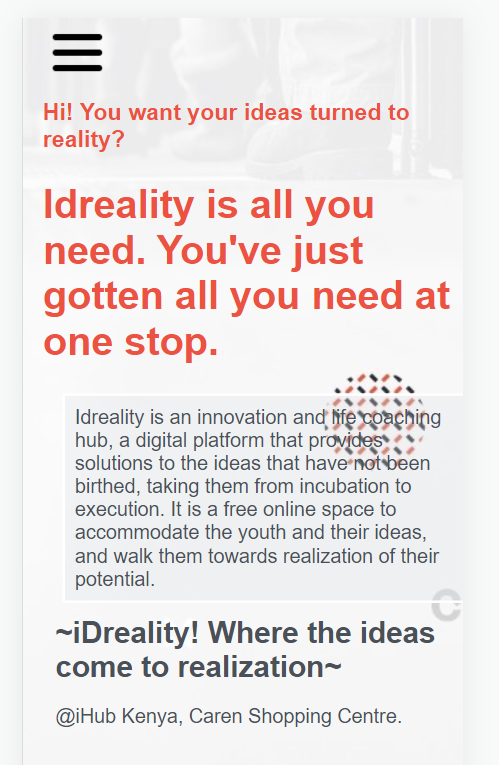
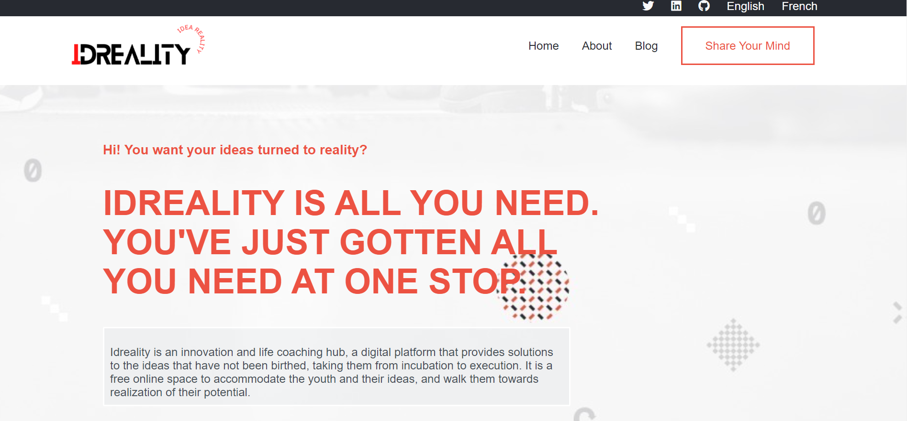

# Capstone-Project-Microverse | iDreality
This is my module one Capstone Project - Microverse

See a short description of the project [here](https://www.loom.com/share/019c9065ab584b62b6c44ee1657c9974)
# ABOUT iDreality
Idreality is an innovation and life coaching hub, a digital platform that provides solutions to the ideas that have not been birthed, taking them from incubation to execution. It is a free online space to accommodate the youth and their ideas, and walk them towards realization of their potential.

Many young people have plentiful ideas in their minds. How to plan and execute these ideas is sometimes a challenge. It is on this foundation that iDREALITY is created to offer a solution to the youth. 
To bring these ideas to reality requires a special kind of discipline, which often calls for training and coaching. To guide the minds of young and vibrant youth to birth their ideas to reality requires highly effective and trained mentors, professionals with vast experience in various spaces and fields. 
iDREALITY seeks to digitally provide solutions, guidance and coaching to young people, to nurture their ideas and lead them to an execution paradigm. 
We aim to provide talented and creative individuals with a platform where they can meet professionals who are eager to see them birth the innovativeness within them.

See the project screenshots below:

## Built With

- Major languages - <b>HTML</b>, <b>CSS</b> and var s = "JavaScript"; alert(s);

## Getting Started

Live link: https://white3d.github.io/Capstone-Project-Microverse/

Use this url to clone the repo on your terminal: https://github.com/white3d/Capstone-Project-Microverse.git

## Authors

👤 **Edward Odhiambo**

[Portfolio Website](https://odhiambo-edward.netlify.app/)

- GitHub: [@whit3d](https://github.com/white3d)
- Twitter: [@odhiambo_ed](https://twitter.com/odhiambo_ed)
- LinkedIn: [Edward Odhiambo](https://www.linkedin.com/in/edward-odhiambo-6a462a21b/)

## 🤝 Contributing

To any developer who would wish to contribute to this project, you are welcome!

## Show your support

Kindly rate ⭐️ this project if you like it.
## Acknowledgments

- Special thanks to [Cindy Shin](https://www.behance.net/adagio07) - GUI & Graphic Designer for the Template

